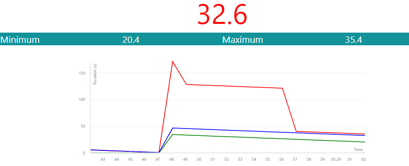

## Demonstrator
{:#demonstrator}

This Web [application](https://codepen.io/kridhaen/pen/VJrezO/) demonstrates the prediction of the current phase duration of a live traffic light in [Antwerp](https://www.openstreetmap.org/#map=19/51.21205/4.39717). 
This gives implementers of route planning engines better insight how traffic lights data work and how its reusability increases by applying prediction methods.
The green, red and blue line on the chart shows respectively the minimum, maximum and predicted duration in seconds of the phase.
On the client-side the latest data from the Open Traffic Lights [API](https://lodi.ilabt.imec.be/observer/rawdata/latest) gets harvested and frequency distributions are constructed with the same strategy as .
This vizualization shows us that the minimum and maximum duration can differ tens of seconds, especially in the beginning. 
Also, when the minimum and maximum duration align, and thus it becomes certain how long the phase take, the blue line gets mostly corrected with a few seconds. This behavior hints to our result from the mean prediction error ().
The source code is available at [https://codepen.io/kridhaen/pen/VJrezO/](https://codepen.io/kridhaen/pen/VJrezO/).

<figure id="codepen">

<figcaption markdown="block">
The blue line shows the predicted phase duration which gives a better understanding how this relates to the minimum (green) and maximum (red) phase duration and whether it was a good prediction in the end.
</figcaption>
</figure>

  See the Pen <a href="https://codepen.io/kridhaen/pen/VJrezO/">
  OpenTrafficLightsPredictor</a> by kridhaen (<a href="https://codepen.io/kridhaen">@kridhaen</a>)
  on <a href="https://codepen.io">CodePen</a>.

