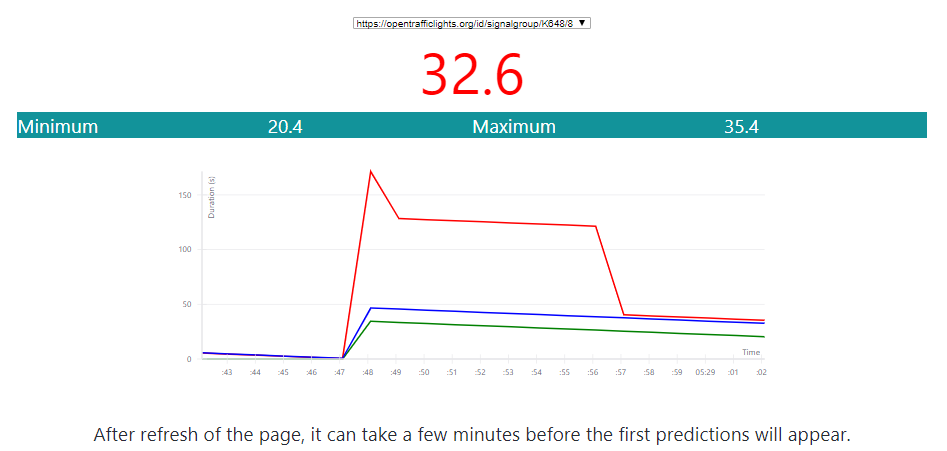

## Demonstrator
{:#demonstrator}

This application demonstrates a Web client that predicts the phase duration of a live traffic light in [Antwerp](https://www.openstreetmap.org/#map=19/51.21205/4.39717). This client continuously fetches the latest data fragment from the OTL API and constructs frequency distributions for every signal group, signal phase, day and time slots of 20 minutes. The median is calculated for the predicted phase duration at the start of every signal phase.

The source code can be found as a Codepen at [https://codepen.io/kridhaen/pen/VJrezO/](https://codepen.io/kridhaen/pen/VJrezO/).

<figure id="codepen">

<figcaption markdown="block">
TODO
</figcaption>
</figure>

  See the Pen <a href="https://codepen.io/kridhaen/pen/VJrezO/">
  OpenTrafficLightsPredictor</a> by kridhaen (<a href="https://codepen.io/kridhaen">@kridhaen</a>)
  on <a href="https://codepen.io">CodePen</a>.

