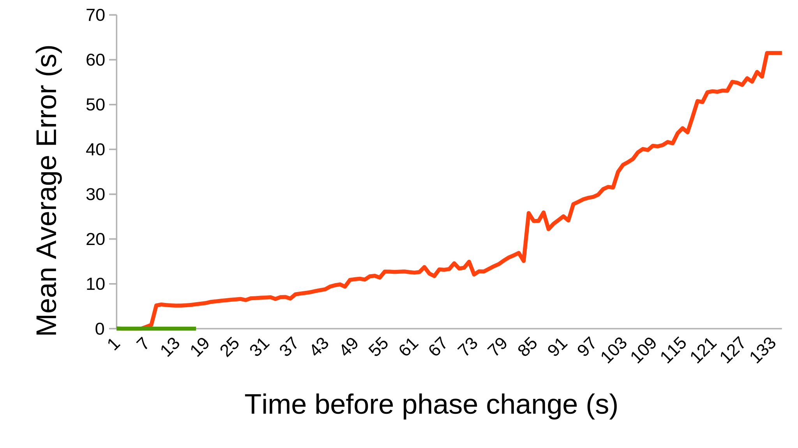

## Predicting the phase duration
{:#predicting-the-phase-duration}

<!-- You don't say which algo you are using and why. Not enough to reproduce.
 -->
To be able to predict the phase duration of a dynamically changing traffic light phase, there are two steps we take: first, we create frequency distributions  of phase durations for every signal group and then we predict the duration for every signal phase and timing (SPAT) update by using a selector on the distribution that is applicable for that update. 
Since traffic patterns can change depending on the time of the day or day of the week, we grouped signal phases by applying multiple strategies .
As a baseline, frequency distributions are created for every signal group and signal phase. 
Then we grouped phases according to their type of day (weekday or weekend) and in time slots of every hour. The reasoning behind this is that a traffic light interacts differently during the weekends and peak hours. As last strategy, we grouped per day (Monday, Tuesday...) and in time slots of 20 minutes.
To predict the duration of a phase from a received update, we tested a few basic selectors: median, mean and mode. These selectors only consider phase durations that take longer than its current duration, because these are still historically possible to occur.
We chose these selectors instead of graph transformations , because we [discovered](https://kridhaen.github.io/OpenTrafficLightsDistributionsVisualizer/) that certain phase durations of our tested dataset occur more frequently than others, which creates peaks in its frequency distribution. This made us hypothesize that this behavior will benefit using a method like the mean.
Finally, to express the prediction error we calculate the mean absolute error (MEA) for every SPAT update $$i$$ as follows  where $$d_p(i)$$ is the predicted duration and $$d(i)$$ the real duration of $$i$$: 
$$MAE = \dfrac{1}{n}\sum_{i=1}^n|d_p(i)-d(i)|$$ . 

## Results
{:#results}

We used traffic lights data from the intersection in Antwerp which contains SPAT updates of 8 [dynamically](http://docs.wegenenverkeer.be/Publicaties/Brochure%20Verkeerslichtengeregelde%20kruispunten.pdf) changing signal groups.
To run reproducible tests, we harvested a [dataset](https://github.com/kridhaen/OpenTrafficLightsData) from 8th till 25th March 2019 from the OTL endpoint containing 50951 historical fragments.
The test cases are ran using 10-fold cross validation. First, we extracted the SPAT updates from the fragments and randomly divided these in 10 groups. Then we replayed every update $$i$$, who belongs to one group, and predicted its duration $$d_p$$ using the frequency distributions made from the other 9 groups and compared it with its real duration $$d$$. Only updates with unknown duration (minimum and maximum duration differ) are considered.

 shows the MAE for every grouping strategy and method we applied. We see that fine-grained grouping of phases improves the MAE which acknowledges related work . Also, using the median returns lower prediction errors than the mean and mode.
A very good result is considered around 2s according to Bodeheimer et al. , but for a basic algorithm, an input variance of approximately 133s and without using external detector information an overall MAE of 5.1s is still lower than expected. Especially because this test also considers updates whose time till phase change is very high (above 30s).

<figure id="mae-prediction" class="table" markdown="1">

| Method                   | No grouping (s) | Per type of day and every hour (s)  | Per day and every 20 minutes (s) |
| ------------------------ |------------|------------------------------------|------------------------------|
| Median                   | <code>6.8</code>        | <code>5.5</code>     							 | <code>5.1</code>      					| 
| Mean               	   | <code>7.0</code>        | <code>5.9</code>       						 | <code>5.6</code>					        |           
| Mode 					   | <code>7.6</code>        | <code>6.2</code>    							 | <code>6.0</code>				        | 

<figcaption markdown="block">
An overall prediction error of 5.1s is good, because a prediction is made for every SPAT update without using external datasets. This hints that some dynamic traffic lights of Antwerp probably follow a predictable pattern which is feasible for path planning algorithms.

<!-- Don't tell what we see—interpret. What are we supposed to see? Good, bad?
 --></figcaption>
</figure>

To test this causality between the MAE of a signal group and its time until phase change, we plotted this in  for one [signal group](https://opentrafficlights.org/id/signalgroup/K648/3) showing signal phase "[Stop and remain](https://w3id.org/opentrafficlights/thesauri/signalphase/3)" (red line) and "[Protected Movement Allowed](https://w3id.org/opentrafficlights/thesauri/signalphase/6)" (green line). The other signal groups can be found at [https://kridhaen.github.io/OpenTrafficLightsDistributionsVisualizer/](https://kridhaen.github.io/OpenTrafficLightsDistributionsVisualizer/) by pressing the arrow button to "Visualization of the prediction error for each time to phase change for large dataset". With these graphs, a user can compare the predictability of certain signal group and phase combinations.
The signal phase "Protected Movement Allowed" (green line) shows a prediction error of almost 0s which can be confirmed with its [frequency distribution](https://kridhaen.github.io/OpenTrafficLightsDistributionsVisualizer/): its phase duration generally takes 15s and exceptionally 18s. With this knowledge, route planners can safely assume that this signal group will have a green time of at least 15s.
For the signal phase "Stop and remain" (red line), we see three findings. 
First, between 0s and 9s there is no prediction error, because the minimum duration equaled the maximum duration. Next, we see a flat line for phase durations between 9s and 65s with a MAE around 10s. Although we don't know the exact distribution of the errors, a route planner needs to be aware that the prediction is on average this much off so it must do a best-effort to minimize the consequences for the driver. For example, when the phase is 60s before change: on the one hand a prediction of 50s can lead to 10s of waiting before a red light, on the other hand a prediction of 70s means that it is already 10s green with 5s remaining. This raises a new challenge whether the driver will be able to pass the green light in those 5s depending on the crowdedness.
Lastly, above 65s the prediction error grows linear. Although these long phase durations occur exceptionally, otherwise the overall MAE would be much higher, route planning during such a phase would return completely unreliable results. 

<figure id="time-till-transition">

<figcaption markdown="block">
Predicting the duration of signal phase "Protected Movement Allowed" (green line) for this signal group is perfectly possible as its prediction error is almost 0s. 
For signal phase "Stop and remain" (red line), we deem a prediction error around 10s still valuable for route planning.
</figcaption>
</figure>

<!-- Good, bad, success, failure??
 -->
