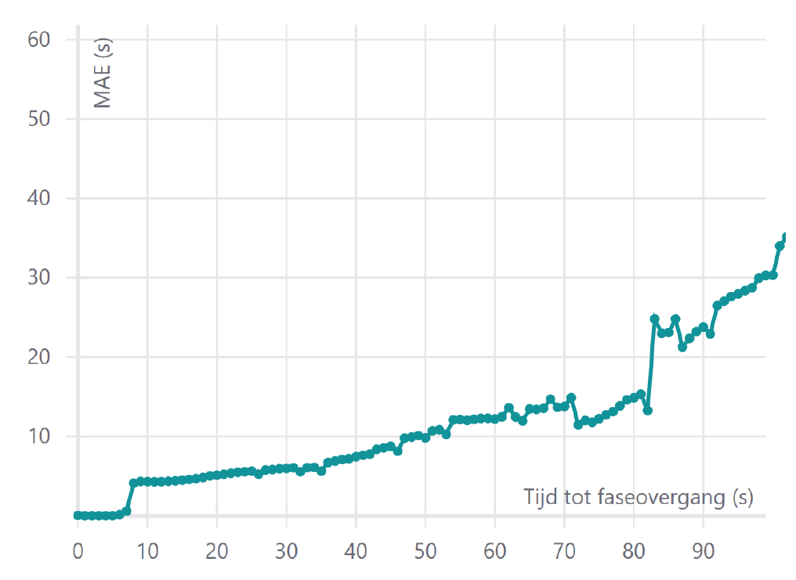

## Predicting the phase duration
{:#predicting-the-phase-duration}

<!-- **Discovery**

**Geo mapping**

**Prediction**
 -->
To run reproducable tests for the prediction of the phase duration, a [dataset](https://github.com/kridhaen/OpenTrafficLightsData) from 8th till 25th March 2019 is maintained containing 50951 historical fragments. From these fragments, the phase and timing of signal groups can be extracted and used for generating a frequency distribution. At least for every signal group and phase combination one frequency distribution should be made. Predictions are only generated for SPAT messages where its minimum end time differs from its maximum end time. 
In contrast to the fixed cycle times in related work , the traffic lights controller in [Antwerp](https://docs.wegenenverkeer.be/Vademecum
s/Vademecum%5C%20Veilige%5C%20wegen%5C%20en%5C%20kruispunten/3.2.%5C%
20Modeloplossingen%5C%20Verkeerslichten.pdf) dynamically changes the cycle time to the live situation on the intersection (crowdedness, pedestrian pushing a detector etc.). To make a prediction of the phase duration, we used three grouping strategies for creating frequency distributions. As a baseline, we used no grouping. This means that only one distribution is created for every signal phase containing all historical phase durations. Next, we created a distribution per type of day (weekend or weekday) and for every hour. The reasoning behind this is that the traffic lights controller interacts differently during the weekends and peak hours. The last strategy is more fine-grained and groups per day (monday, tuesday...) and in time slots of 20 minutes. We used three methods to select a predicted duration $$d_p$$: the median, mean and mode. To measure the prediction error we calculate the mean absolute error (MEA) as follows: 
$$MAE = \dfrac{1}{n}\sum_{i=1}^n|d_p(i)-d(i)|$$
After creating the distributions, we calculated for every SPAT message $$i$$ its predicted duration $$d_p$$ and compared this with its real duration $$d$$. By taking the mean from these errors we know how many seconds on average the predicted duration deviates from the real duration. 

## Results
{:#results}

 shows the MAE for every grouping strategy and method we applied. We see that fine-grained grouping of phases improves the MAE which acknowledges the strategy of Bodenheimer et al.. Also, the median returns a better result than the mean and mode.

<figure id="mae-prediction" class="table" markdown="1">

| Method                   | No grouping (s) | Per type of day and every hour (s)  | Per day and every 20 minutes (s) |
| ------------------------ |------------|------------------------------------|------------------------------|
| Median                   | 6.8        | 5.5      							 | 5.1      					| 
| Mean               	   | 7.0        | 5.9       						 | 5.6					        |           
| Mode 					   | 7.6        | 6.2    							 | 6.0 					        | 

<figcaption markdown="block">
Comparison of the mean absolute error (MAE) for different grouping strategies and methods for choosing the prediction. Using the median and fine-grained grouping (per day and time buckets of 20 minutes) gives the lowest MAE of 5.1 seconds.
</figcaption>
</figure>

We go a step further by also considering the time that is left before the phase of a SPAT message $$i$$ changes to the next phase. The hypothesis is that in the beginning of a phase the prediction error will be higher then on the end of the phase.  confirms that the prediction error (MAE) is high when the time till phase change is high and lowers when reaching the end of the phase. This is done by grouping per day and every 20 minutes (the third grouping strategy) and by taking the median for the prediction phase. To explain why these results are much higher then the average MAE 5.1s in  is that there are much more phases that take less than 50 seconds which weighs in more on the average MAE.

<figure id="time-till-transition">

<figcaption markdown="block">
The mean absolute error (MAE) lowers when the end of phase nearing. Predictions are created by using the median and frequency distributions are created by grouping phases per day and every 20 minutes. This is calculated for signal phases that correspond with a red color on a traffic light.
</figcaption>
</figure>

<!--  With a frequency distribution it is also possible to make a prediction based on a fixed probability. --> 
A cumulative frequency distribution can also be used for predicting with intervals instead of one predicted duration . 90% of the phase durations are inside the [5%, 95%] interval, so it is 90% certain that the phase will take place between that interval.

In next section we demonstrate a HTTP client that generates a prediction for the phase duration on-the-fly. 

<!-- Met vaste zekerheid routeren (bv. 90% zekerheid -> groter deel van de faseduur routeren ) -->