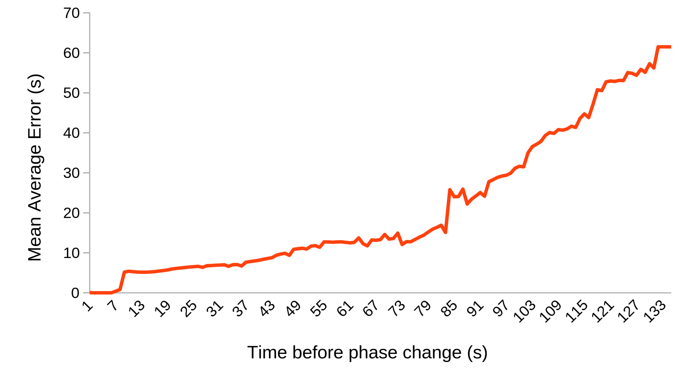

## Predicting the phase duration
{:#predicting-the-phase-duration}

Imagine a route planner receives a live update from a traffic light that is still uncertain when it will end. For every update it receives, the phase duration of a signal phase can be predicted using a frequency distribution.  
Instead of grouping signal phases for every fixed cycle time in related work , we group in different time slots, because the traffic lights controller in [Antwerp](https://docs.wegenenverkeer.be/Vademecum
s/Vademecum%5C%20Veilige%5C%20wegen%5C%20en%5C%20kruispunten/3.2.%5C%
20Modeloplossingen%5C%20Verkeerslichten.pdf) dynamically changes the cycle time to the live situation on the intersection (crowdedness, pedestrian pushing a detector etc.). As a baseline, we used no grouping in time. This means that only one distribution is created for every signal phase containing all historical phase durations. Next, we grouped per type of day (weekend or weekday) and for every hour. The reasoning behind this is that the traffic lights controller interacts differently during the weekends and peak hours. The last strategy is more fine-grained and groups per day (monday, tuesday...) and in time slots of 20 minutes.
To select a predicted duration $$d_p$$, we used the median, mean and mode. We calculate the prediction error with the mean absolute error (MEA) as follows: 
$$MAE = \dfrac{1}{n}\sum_{i=1}^n|d_p(i)-d(i)|$$
After creating the distributions, we calculated for every SPAT message $$i$$ its predicted duration $$d_p$$ and compared this with its real duration $$d$$. By taking the mean from these errors we know how many seconds on average the predicted duration deviates from the real duration. 

## Results
{:#results}

To run reproducable tests, a [dataset](https://github.com/kridhaen/OpenTrafficLightsData) from 8th till 25th March 2019 is harvested from the OTL endpoint containing 50951 historical fragments. The test cases are ran using 10-fold cross validation. First, we extracted the phase and timing of signal groups and randomly divided these in 10 groups. Then predictions are made by replaying every SPAT update, who belongs in one group, using the frequency distributions made from the other 9 groups.
 shows the MAE for every grouping strategy and method we applied. We see that fine-grained grouping of phases improves the MAE which acknowledges related work . Also, the median returns a better result for all three groupings than the mean and mode.

<figure id="mae-prediction" class="table" markdown="1">

| Method                   | No grouping (s) | Per type of day and every hour (s)  | Per day and every 20 minutes (s) |
| ------------------------ |------------|------------------------------------|------------------------------|
| Median                   | <code>6.8</code>        | <code>5.5</code>     							 | <code>5.1</code>      					| 
| Mean               	   | <code>7.0</code>        | <code>5.9</code>       						 | <code>5.6</code>					        |           
| Mode 					   | <code>7.6</code>        | <code>6.2</code>    							 | <code>6.0</code>				        | 

<figcaption markdown="block">
Comparison of the mean absolute error (MAE) for different grouping strategies and methods for choosing the prediction. Using the median and fine-grained grouping (per day and time buckets of 20 minutes) gives the lowest MAE of 5.1 seconds.
</figcaption>
</figure>

We go one step further by also considering the time that is left before the phase of a SPAT message $$i$$ makes a transition to the next phase. We hypothesize that in the beginning of a phase the prediction error will be higher then on the end of the phase.
Signal phases are grouped per day and every 20 minutes (the third grouping strategy) and the median is used for the prediction.
  shows for the [signal phase](https://w3id.org/opentrafficlights/thesauri/signalphase/3) with label "Stop and remain" how its prediction error (MAE) compares with the time that a phase took. We see can three findings: first, the prediction error grows linear for phase durations above 62 seconds. This is because very long phase occur less, thus using the median for outliers is not a good fit. Secondly, we see a more flat line for phase durations between 9 and 65 seconds with a MAE around 10 seconds. For the bulk of phases, which are between this interval, the median gives a better indication than for outliers. Finally, between 0 and 9 seconds, the prediction error is zero, because the minimum duration equals the maximum duration.

<figure id="time-till-transition">

<figcaption markdown="block">
The mean absolute error (MAE) lowers when the end of phase nearing. Predictions are created by selecting the median and using frequency distributions that group phases per day and every 20 minutes. This is calculated from [signal phase](https://w3id.org/opentrafficlights/thesauri/signalphase/3) with label "Stop and remain" which corresponds with a red color on a traffic light.
</figcaption>
</figure>

In next section, we demonstrate a HTTP client that generates a prediction for a live traffic light on-the-fly.